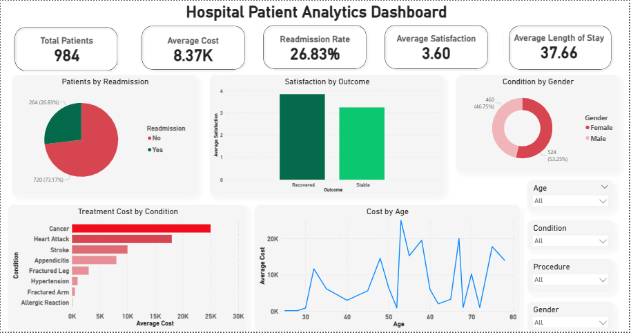

# 🏥 Hospital Patient Analytics Dashboard (Power BI)

## 📌 Project Overview

This project presents an interactive Power BI dashboard to analyze hospital patient data, focusing on treatment cost, patient outcomes, hospital efficiency, and readmission patterns. The dashboard helps in deriving insights for better healthcare decision-making.

## 🛠️ Tools & Technologies

* Power BI
* Power Query
* DAX (Data Analysis Expressions)

## 📊 Dashboard Features

* KPI Cards: Total Patients, Average Cost, Length of Stay, Readmission Rate, Satisfaction
* Condition-wise patient distribution
* Cost analysis by age group
* Readmission analysis
* Outcome and satisfaction analysis
* Interactive filters (Condition, Procedure, Age)

## 🔧 Data Preparation

* Converted data types for numerical analysis
* Handled missing values appropriately
* Standardized categorical fields (Readmission, Outcome)
* Ensured data consistency for accurate insights

## 📈 Key KPIs

* Total Patients
* Average Treatment Cost
* Average Length of Stay
* Readmission Rate
* Average Satisfaction Score

## 🔍 Key Insights

* Certain medical conditions contribute to higher patient volume
* Older age groups tend to incur higher treatment costs
* Readmission rates highlight potential gaps in treatment effectiveness
* Patient outcomes and satisfaction help evaluate hospital service quality

## 📸 Dashboard Screenshot

## 🎯 Conclusion

The dashboard provides a comprehensive view of hospital operations, helping identify cost patterns, patient outcomes, and efficiency gaps for improved decision-making.

## 🚀 Outcome

* Built an interactive healthcare analytics dashboard
* Transformed raw data into meaningful insights
* Demonstrated practical data visualization skills using Power BI
